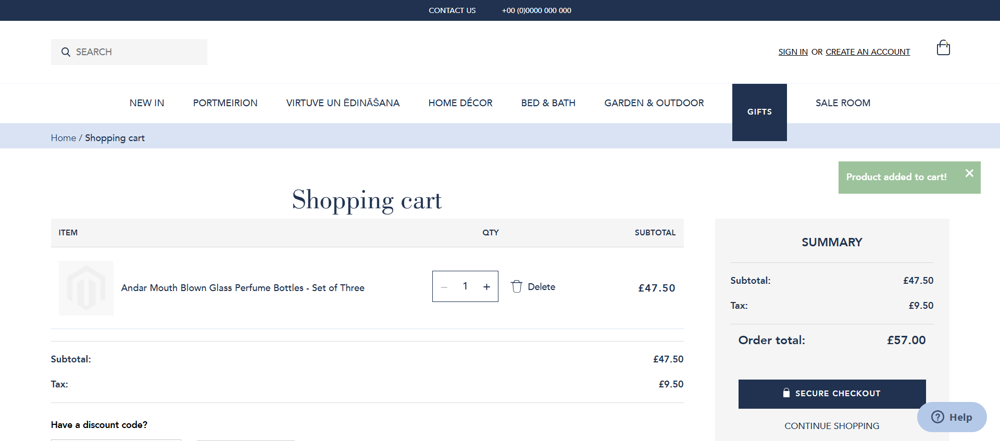
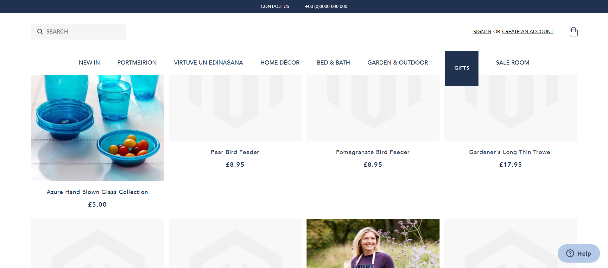

# QA e-commerce take-home task 

**Project type:** Real-world interview assignment (manual testing only)  
**My addition:** Full end-to-end Selenium automation suite (JavaScript / Node.js)  
**Site:** private, intentionally unfinished e-commerce PWA with numerous bugs

## Automated test cases

| # | Test case                              | Status | Screenshot                                      |
|---|----------------------------------------|--------|-------------------------------------------------|
| 1 | Successful login                       | PASS   |  |
| 2 | Add to basket – specific product       | PASS   |                                       |
| 3 | Category → sort by price: low to high  | PASS   |                                                 |

## Project origin & initiative
This project began as a manual-only take-home QA task from a mid-sized e-commerce company during a job interview.  
The original requirement was to find and report bugs manually.  
I decided to go further and built a Selenium automation suite — turning a simple manual assignment into three reliable, automated tests that work on a deliberately broken, unfinished site.

## Challenges overcome
- React mega-menus with dynamic rendering
- “Element not interactable” and lazy-loading issues
- Unstable UI components and missing stable selectors
- Intentional bugs and incomplete functionality

## Tech Stack
- Selenium WebDriver
- JavaScript (Node.js)
- XPath & CSS selectors
- ChromeDriver

## How to run
```bash
git clone https://github.com/Klimcuks/qa-ecommerce-project.git
cd qa-portfolio-ecommerce-task
npm install selenium-webdriver chromedriver
node loginTest.js
node addToCartTest.js
node sortTest.js
```
